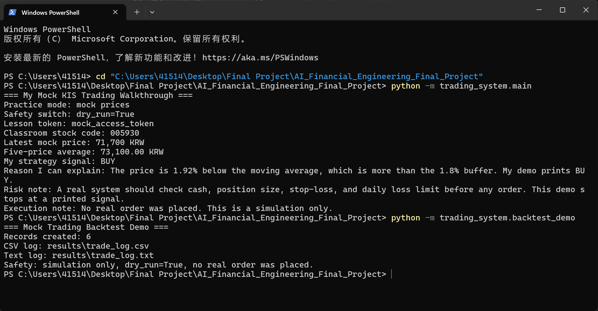
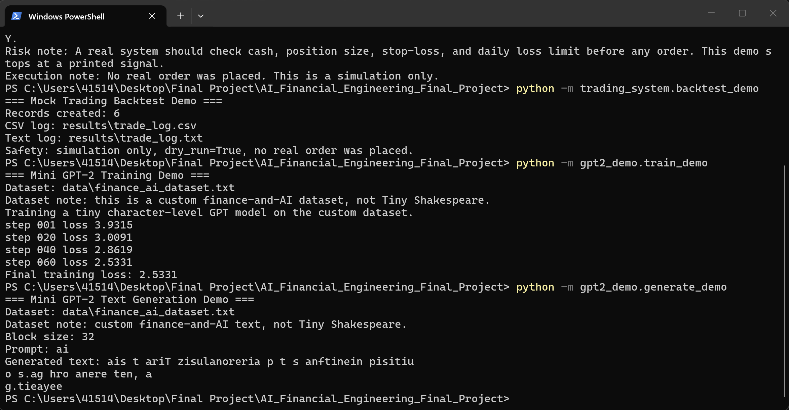

# AI Financial Engineering Final Project

This is my final project for the university course **Artificial Intelligence and Financial Engineering**.

I kept the project small on purpose. My goal is not to build a production trading bot or a huge language model. My goal is to make a runnable project that I can explain clearly, file by file and function by function, during an oral test.

The project has two connected parts:

1. A mock automatic trading walkthrough inspired by the Korea Investment Securities API, also called 한국투자증권 API or KIS API.
2. A small-scale educational GPT-2 style implementation with the main transformer components.

The GPT-2 part includes token embedding, positional embedding, masked multi-head self-attention, feed-forward network, transformer block, and text generation. The purpose is to make the main GPT-2 structure clear through a small runnable example.

## Project Structure

```text
AI_Financial_Engineering_Final_Project/
|-- README.md
|-- requirements.txt
|-- .gitignore
|-- .env.example
|-- data/
|   `-- finance_ai_dataset.txt
|-- trading_system/
|   |-- __init__.py
|   |-- config.py
|   |-- kis_auth.py
|   |-- kis_market.py
|   |-- strategy.py
|   |-- backtest_demo.py
|   `-- main.py
|-- gpt2_demo/
|   |-- __init__.py
|   |-- model.py
|   |-- train_demo.py
|   `-- generate_demo.py
`-- results/
    |-- trading_sample_output.txt
    |-- trade_log.csv
    |-- trade_log.txt
    `-- gpt_sample_output.txt
```

## Installation

Run this from the project root:

```bash
python -m pip install -r requirements.txt
```

The project uses PyTorch for the GPT demo. It does not require a GPU.

Important safety note: do not create or commit a real `.env` file. This repository only includes `.env.example`, and the values inside it are fake placeholders.

## How To Run

Run the mock trading walkthrough:

```bash
python -m trading_system.main
```

Run the mock trading backtest and create trade records:

```bash
python -m trading_system.backtest_demo
```

Run the GPT training demo:

```bash
python -m gpt2_demo.train_demo
```

Run the GPT text generation demo:

```bash
python -m gpt2_demo.generate_demo
```

## Trading Record

This project prepares simulated automatic trading records for GitHub grading. The records are created with mock prices and `dry_run=True`, so they are only practice records. They do not come from a real KIS API account, and no real order is placed.

Run this command to regenerate the trading records:

```bash
python -m trading_system.backtest_demo
```

The generated files are:

- [results/trade_log.csv](results/trade_log.csv)
- [results/trade_log.txt](results/trade_log.txt)

The CSV file is useful for checking the records like a spreadsheet. The text file is useful for reading the simulated steps in a simple report format. Each record includes the step, symbol, current price, moving average, signal, reason, dry-run value, and order status.

## GPT-2 Dataset

This project does **not** use Tiny Shakespeare. The GPT-2 demo trains on a small custom English dataset about artificial intelligence, financial engineering, stock prices, trading signals, risk management, and GPT models.

Dataset file:

- [data/finance_ai_dataset.txt](data/finance_ai_dataset.txt)

The dataset is intentionally small so the tiny GPT-style model can train quickly on a normal laptop. It is used only for educational demonstration.

## Running Results

### Mock KIS Trading System Result

The screenshot below shows the mock KIS trading walkthrough running in the terminal. The system uses mock price data, runs with dry_run=True, generates a simulated BUY / SELL / HOLD signal, and does not place any real order.



### Mini GPT-2 Training and Generation Result

The screenshot below shows the mini GPT-2 demo running in the terminal. The training loss decreases during the small training demo, and the generation script produces a short sample text. The generated text is not fluent because the model is very small and trained on a tiny dataset, but it demonstrates the basic training and text generation workflow.



## Part 1: My Mock KIS Trading Walkthrough

### What This Part Shows

This part shows the basic shape of an automatic trading system without touching a real brokerage account.

The workflow is:

1. Read safe settings.
2. Get a mock access token.
3. Load fake stock price data.
4. Calculate a five-price moving average.
5. Compare the latest price with the average.
6. Print `BUY`, `SELL`, or `HOLD`.
7. Print a short risk-management reminder.
8. Optionally run a mock backtest to save simulated trade records.

### What Is An API?

An API is a way for one program to talk to another program. In a real financial system, an API could be used to request stock prices, check account data, or place orders.

In this project, the API idea is only simulated. The program does not contact a real KIS server.

### What Is KIS API?

KIS API means Korea Investment Securities API, or 한국투자증권 API. A real KIS API can connect software to brokerage services.

In my project, KIS API is used only as a concept:

- authentication concept
- access token concept
- market price request concept
- trading signal concept

No real KIS API request is made by default.

### What Is An Access Token?

An access token is like a temporary permission pass. A real API usually gives a token after checking app credentials.

In this project, mock mode returns:

```text
mock_access_token
```

That token is fake. It is only printed so I can explain where a token would appear in the workflow.

### What Is Mock Mode?

Mock mode means the program uses fake sample data instead of a real API.

In `trading_system/config.py`, the default is:

```python
MOCK_MODE = True
```

This is why the trading demo can run without API keys.

### What Is Dry-Run Mode?

Dry-run mode means the program only explains what it would do. It does not place an order.

In `trading_system/config.py`, the default is:

```python
DRY_RUN = True
```

### My Trading Rule

The trading rule is intentionally simple:

1. Calculate the average of the latest five prices.
2. Compare the latest price with that average.
3. Use a 1.8% buffer so tiny price movement does not automatically become a signal.

The signal rule is:

- `BUY`: latest price is more than 1.8% below the moving average.
- `SELL`: latest price is more than 1.8% above the moving average.
- `HOLD`: latest price is inside the 1.8% buffer.

With the current mock data, the latest price dips below the average enough to produce an easy-to-explain `BUY` signal.

### Risk-Management Note

The output includes a risk note because real trading decisions should never depend on one signal only. A real system should also check cash, position size, stop-loss rules, and daily loss limits.

This project does none of those real trading actions. It only prints a simulated signal.

## Trading Files: Function By Function

### `trading_system/config.py`

- `read_bool_env(name, default)`
  - Reads a true/false setting if it exists.
  - Mock mode does not require a `.env` file.

- `validate_safety_settings()`
  - Stops unsafe setting combinations.
  - Keeps real trading disabled by default.

Important values:

- `MOCK_MODE = True`
- `DRY_RUN = True`
- `REAL_TRADING_ENABLED = False`
- `THRESHOLD_PERCENT = 0.018`
- `STOCK_SYMBOL = "005930"`

### `trading_system/kis_auth.py`

- `get_access_token()`
  - Returns `mock_access_token` in mock mode.
  - This represents the place where a real access token would appear.

- `request_real_access_token_template()`
  - Shows the safe structure of real authentication.
  - Does not make a real network request.
  - Does not include secrets.

### `trading_system/kis_market.py`

- `get_stock_price(access_token, symbol)`
  - Gets stock data.
  - Uses mock data by default.

- `get_mock_stock_price(symbol)`
  - Returns a short fake price history.
  - The default stock code is `005930`.

- `request_real_stock_price_template(access_token, symbol)`
  - Shows where a real market price request would go.
  - Stays disabled for this educational project.

### `trading_system/strategy.py`

- `calculate_moving_average(prices, window)`
  - Takes the latest prices and calculates their average.

- `generate_signal(current_price, moving_average, threshold_percent)`
  - Compares the latest price to the moving average.
  - Returns `BUY`, `SELL`, or `HOLD`.
  - Also returns a plain-English reason.

### `trading_system/main.py`

- `build_output_text(...)`
  - Creates the terminal report with renamed labels and a risk note.

- `save_sample_output(output_text)`
  - Saves the same terminal text to `results/trading_sample_output.txt`.

- `run_trading_demo()`
  - Runs the whole mock workflow in order.

### `trading_system/backtest_demo.py`

- `build_trade_records()`
  - Simulates several mock price steps.
  - Creates BUY, SELL, or HOLD records using the same moving-average strategy.

- `save_trade_log_csv(records, output_path)`
  - Saves the simulated records to `results/trade_log.csv`.

- `save_trade_log_txt(records, output_path)`
  - Saves the same records to `results/trade_log.txt` in a readable report format.

- `run_backtest_demo()`
  - Runs the mock backtest and writes both trade-log files.
  - Keeps the result clearly marked as simulation only.

## Part 2: My Small GPT-2 Style Demo

### What This Part Shows

This part is a small character-level transformer trained on `data/finance_ai_dataset.txt`. It is not meant to create high-quality text. It is meant to show the main ideas behind GPT in code that is short enough to explain.

The dataset is a custom finance-and-AI dataset. It is not Tiny Shakespeare.

### What Is GPT?

GPT means Generative Pre-trained Transformer. In simple words, it predicts the next token from previous tokens.

In this demo, each character is a token. That keeps the tokenizer very simple.

### Token Embedding

Token embedding turns token IDs into vectors. The model cannot learn directly from letters, so it learns from number vectors.

### Positional Embedding

Attention does not automatically know the order of characters. Positional embedding adds information about where each character is located.

### Q, K, V

In attention:

- `Q` means query: what the current position is looking for.
- `K` means key: what each position offers.
- `V` means value: the information that gets copied after attention weights are calculated.

### Masked Self-Attention

GPT predicts the next token, so it should not look at future tokens. The mask hides future positions.

Example: when the model predicts character 5, it may look at characters 1 to 5, but not character 6.

### Multi-Head Attention

Multi-head attention means the model has several attention heads at the same time. Each head can learn a different kind of relationship.

### Feed-Forward Network

The feed-forward network is a small neural network after attention. It processes the information at each position.

### Transformer Block

A transformer block combines:

1. Layer normalization
2. Masked multi-head self-attention
3. Residual connection
4. Layer normalization
5. Feed-forward network
6. Residual connection

### Text Generation

The model starts with a prompt, predicts the next character, adds it to the prompt, then repeats the same step.

## GPT Files: Function By Function

### `data/finance_ai_dataset.txt`

- Contains the small custom training dataset.
- The text is about artificial intelligence, financial engineering, stock prices, trading signals, risk management, and GPT models.
- It is included so the GPT demo trains on a project-specific dataset instead of Tiny Shakespeare.

### `gpt2_demo/model.py`

- `CharTokenizer`
  - Converts characters to token IDs.
  - Converts token IDs back to characters.

- `MultiHeadSelfAttention`
  - Builds Q, K, and V.
  - Applies the future-token mask.
  - Combines multiple attention heads.

- `FeedForward`
  - Adds a small neural network after attention.

- `TransformerBlock`
  - Combines attention, feed-forward network, layer normalization, and residual connections.

- `MiniGPT`
  - Combines token embedding, positional embedding, transformer blocks, final layer normalization, and output layer.
  - Includes `generate()` for simple text generation.

### `gpt2_demo/train_demo.py`

- `load_training_text()`
  - Reads the custom dataset from `data/finance_ai_dataset.txt`.
  - This dataset is not Tiny Shakespeare.

- `create_model_and_tokenizer()`
  - Creates the tokenizer and the small model from the custom dataset.

- `get_batch(data, block_size, batch_size)`
  - Selects short training examples from the custom finance-and-AI dataset.

- `train_model(steps=60, show_loss=True)`
  - Trains the model briefly.
  - Prints loss so I can show that learning is happening.

- `main()`
  - Runs the training demo.

### `gpt2_demo/generate_demo.py`

- `save_sample_output(output_text)`
  - Saves the generation result to `results/gpt_sample_output.txt`.

- `run_generation_demo()`
  - Trains briefly in memory.
  - Starts from the prompt `ai`.
  - Generates a short character-level text sample.

- `main()`
  - Runs the generation demo.

### `results/trade_log.csv`

- Stores the simulated trading records in CSV format.
- Includes step, symbol, current price, moving average, signal, reason, dry-run value, and order status.

### `results/trade_log.txt`

- Stores the same simulated trading records in a readable text format.
- Clearly states that the records are simulation only and no real order was placed.

## Sample Outputs

### Trading Sample

```text
=== My Mock KIS Trading Walkthrough ===
Practice mode: mock prices
Safety switch: dry_run=True
Lesson token: mock_access_token
Classroom stock code: 005930
Latest mock price: 71,700 KRW
Five-price average: 73,100.00 KRW
My strategy signal: BUY
Reason I can explain: The price is 1.92% below the moving average, which is more than the 1.8% buffer. My demo prints BUY.
Risk note: A real system should check cash, position size, stop-loss, and daily loss limit before any order. This demo stops at a printed signal.
Execution note: No real order was placed. This is a simulation only.
```

### GPT Sample

```text
=== Mini GPT-2 Text Generation Demo ===
Dataset: data\finance_ai_dataset.txt
Dataset note: custom finance-and-AI text, not Tiny Shakespeare.
Block size: 32
Prompt: ai
Generated text: ais t ariT zisulanoreria p t s anftinein pisitiu
o s.ag hro anere ten, a
g.tieayee
```

The generated text is strange because the model is very small and trains only briefly. That is acceptable here because the purpose is to explain the GPT structure, not to produce perfect language.

## Safety Notes

- No real API keys are included.
- No real app secrets are included.
- No real account numbers are included.
- `.env` is ignored by `.gitignore`.
- Only `.env.example` is included, and it contains fake placeholders.
- Mock mode is enabled by default.
- Dry-run mode is enabled by default.
- Real trading is disabled by default.
- The program prints simulated signals only.
- The real KIS API functions are templates only.

## Public GitHub Safety Check

This repository is safe to upload publicly because:

- It contains no real secrets.
- `.env` is ignored.
- `.env.example` uses fake values only.
- Mock mode is the default.
- Dry-run mode is the default.
- Real trading is disabled.
- Real API functions are templates only.
